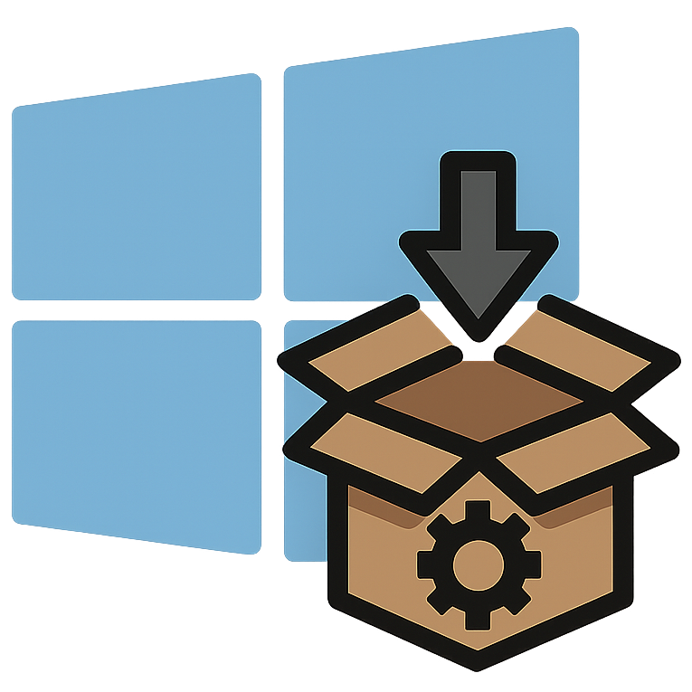

[](https://app.warp.dev/referral/Q4JENP)

# Windows Ultimate Configurator



*For everyone tired of Microsoft telling them their perfectly good computer isn't good enough for Windows 11.*

Look, Windows 11 has some nice features, but Microsoft's hardware requirements are pretty ridiculous. This tool let's you have control over your own computer. Whether you're running older hardware that works just fine *but Microsoft says it doesn't*, or you just want Windows to stop spying on you and actually run fast, this tool has what you need.

> [!IMPORTANT]
> **THIS IS STILL A WORK IN PROGRESS**
> - The `autounattended.xml` file should work just fine.
> - It has been tested on a brand new install using a USB created with Rufus and it bypassed all the requirements just fine.
> - Please let me know if this works for you or if you find any bugs so I can iron them out as I work the next version.


> [!CAUTION]
> - **This tool modifies Windows registry settings and system configuration**.
> - While all changes use standard Windows mechanisms, you should understand what each option does before applying it.
> - Some options *particularly in the bypass category* are specifically designed to work around Microsoft's intended behavior.
> - **Use at your own discretion**.
> - **Always have a backup strategy**.

>[!TIP]
> If you just want to get things going, skip to the [Quick Start](https://github.com/SilentGlasses/winuc?tab=readme-ov-file#quick-start) section.

## Why Windows 11 Requirements Hurt Users, and the Planet

Microsoft’s aggressive hardware requirements don’t just inconvenience users—they create larger problems:

- **Unnecessary E-Waste**: Millions of capable PCs are blocked from upgrading, pushing users toward buying new hardware and adding to global electronic waste.
- **Hidden Costs**: Users face expensive, forced upgrades even when their current systems still work perfectly fine.
- **Environmental Toll**: Manufacturing new computers consumes rare materials, water, and energy, meaning more carbon emissions for no real gain.
- **Artificial Limitations**: These restrictions don’t always translate to meaningful performance or security improvements. *They’re corporate policy and greed masquerading as necessity and security*.

### Microsoft’s Requirements vs. Real-World Performance

| Aspect                   | Windows 11 Official Requirements | With Bypass / Optimization  |
|--------------------------|----------------------------------|-----------------------------|
| **CPU**                  | 8th Gen Intel / AMD Ryzen 2000+  | Works on older CPUs         |
| **TPM 2.0**              | Mandatory                        | Optional (can be bypassed)  |
| **Secure Boot**          | Mandatory                        | Optional (user-controlled)  |
| **Hardware Longevity**   | Forces upgrades                  | Extends usable lifespan     |
| **Environmental Impact** | Increased e-waste                | Reduces e-waste, re-use     |

- **~240 million PCs** worldwide are considered incompatible with Windows 11, despite being fully functional and capable of running it.
- The world generates **over 50 million metric tons of e-waste annually**, that's equivalent to throwing away 1,000 laptops every second.
- Extending a device’s lifespan by just **2 years** can reduce the total carbon footprint by **up to 30%**.

>[!TIP]
> Green House Gases (GHG) emissions from e-waste have **increased by ~53% over six years**; extending usable life helps slow that trend.

## Or, Just Use Linux Instead

To be honest, sometimes you need Windows for specific software or work requirements. But if you're mainly browsing the web, writing documents, or doing general computer stuff, Linux might be the better answer.

Here's the thing: while Microsoft is making Windows more **restrictive** and **invasive** with every update, Linux is going the opposite direction. With Linux, you get:

- **Actually Free Software**: Not free with hidden costs and data harvesting, just genuinely free. The entire OS, plus thousands of applications, cost you nothing and come without strings attached.
- **Your Computer, Your Rules**: No forced updates, no telemetry you can't disable, no Microsoft account requirements. You decide what runs on your machine and when.
- **Privacy by Default**: Linux distributions don't phone home, track your usage, or build advertising profiles. What you do on your computer stays on your computer.
- **Security That Works**: Regular security updates without the bloatware. No Windows Defender slowing everything down.
- **Runs on Anything**: That incompatible hardware Microsoft rejected? Linux will probably make it run better than it ever did on Windows. I'm literally writing this on a machine that Microsoft says can't run Windows 11.
- **Real Support Community**: When something breaks, you get help from people who actually know the system, not chatbots reading from scripts.

Distributions like **Fedora**, **Linux Mint**, or **Pop!_OS** are genuinely easier to use than Windows 11 for most people. The learning curve exists, but it's way smaller than dealing with Microsoft's constant _improvements_ that make everything worse.

Sure, gaming used to be Linux's weak spot, but with Steam's Proton and native Linux games, most stuff just works now. And if you absolutely need Windows for something specific, you can run it in a virtual machine with all the spying turned off.

**Bottom line**: If Microsoft's hardware requirements pushed you here, maybe that's a sign it's time to try something that respects both your hardware and your privacy.

## Safety & Compatibility

All changes are made through standard Windows registry modifications, nothing sketchy or nefarious. The tool creates registry paths as needed and handles both `string` and `DWORD` values correctly.

That being said, some changes like disabling System Restore or User Access Control (UAC) do reduce system protection, so think about what you actually need. Most people will want the bypass and privacy options, with performance and appearance tweaks being additional personal preference.

>[!TIP]
> By keeping older hardware running longer, you’re not just saving money, you’re helping reduce electronic waste and lowering the environmental footprint of constant forced upgrades.

## What Does This Do?

This tool does two main things:

1. it lets you install Windows 11 on hardware Microsoft doesn't want you to use, and
2. it fixes a lot of the annoying defaults Microsoft ~~ships with~~ forces on you.

The interface is clean and actually respects your Windows theme (automatically detecting light/dark mode). The tool presents a responsive grid layout with organized categories. Each category is clearly labeled with option counts, and when you hover over any option, you get a plain English explanation of what it actually does - no corporate speak or technical jargon.

You can either apply changes directly to your current system (using the **Apply** button), or generate an unattended install file (using the **Generate** button) that does everything automatically during Windows installation. The interface also provides category-specific selection buttons (Bypass, Privacy, Security, etc.) and **Select All**/**Clear All** options for convenience.

>[!TIP]
> If you’re running Windows 11 on older hardware, you’re extending the usable life of your device, avoiding premature obsolescence and helping cut down on the cycle of unnecessary e-waste.

## What's Inside

- **Bypass the BS**: Install Windows 11 on just about any computer that actually works fine
- **Stop the Spying**: Turn off Microsoft's constant data collection
- **Enhanced Security**: Proper security without the privacy invasions
- **Actually Make it Fast**: Performance tweaks that make real difference
- **Gaming that Works**: Less lag, better frame rates, fewer interruptions
- **Better Networking**: Faster internet without Microsoft's _helpful_ interference
- **System Cleanup**: Get rid of Xbox apps and other junk you didn't ask for
- **Fix the Interface**: Bring back parts of Windows 10 that actually worked

## Quick Start

### Requirements

- Windows 10/11
- PowerShell 5.1 or later _required for modern Windows Forms and .NET Framework features_
- Administrator privileges _required for registry changes and system modifications_

### Running the Tool

- Launch PowerShell with **Run as administrator**
- Allow code execution:
```powershell
Set-ExecutionPolicy Unrestricted -Scope Process -Force
```
- Run:
```powershell
irm https://raw.githubusercontent.com/SilentGlasses/winuc/main/winuc.ps1 | iex
```

That's it. The GUI opens up and you can start making your choices.

## Using the Unattended Install File

If you're doing a fresh Windows 11 install, you can skip all the post-install tweaking by generating an unattended install file. This is especially useful if you're installing on _unsupported_ hardware or setting up multiple machines.

### What You'll Need

- A Windows 11 ISO file
- A USB drive _(8GB+)_
- A tool to create bootable media like Rufus, Ventoy, or even Windows' own Media Creation Tool

### Step-by-Step Process

1. **Generate the unattended file**:
    - Run `winuc.ps1` as described above
    - Select all the options you want
    - Click **Generate** instead of **Apply**
    - This creates `autounattend.xml` in the same folder that you ran the script from
2. **Prepare your installation media**:
    - Create a bootable USB drive with your Windows 11 ISO
    - **Important**: Don't eject the USB yet!
3. **Add the unattended file**:
    - Copy `autounattend.xml` to the **root** of your USB drive or the same level as the `setup.exe` file
    - That's it, Windows will find and use it automatically
4. **Install Windows**:
    - Boot from your USB drive
    - Windows will automatically apply all your selected tweaks during installation
    - No manual configuration needed after install

### What Happens During Install

- **Hardware bypasses** are applied immediately so installation can proceed on _unsupported_ systems
- **Privacy settings** are configured before Windows even finishes installing
- **Performance tweaks** are applied during first boot
- **Bloatware removal** happens automatically
- You get a clean, optimized Windows 11 without the usual setup hassles

### Pro Tips

- **Test first**: Try the unattended install in a virtual machine before using it on real hardware
- **Keep backups**: Save your `autounattend.xml` file so you can reuse it for other installs
- **Multiple versions**: Generate different files for different use cases like a gaming rig vs. work machine
- **USB persistence**: If using Ventoy, you can keep multiple unattended files and choose which one to use

>[!tip]
> The unattended file includes bypass options that let you install on older _unsupported_ hardware, plus privacy and performance settings that take effect immediately. It's like having a system administrator configure everything perfectly while you grab coffee or tea.

## What's Inside

### Windows 11 Bypass Options

Because your 2017 laptop with that 8th gen CPU is actually fine.

- **Bypass TPM 2.0 Requirement**: Skip the TPM 2.0 nonsense
- **Bypass Secure Boot Requirement**: Ignore Secure Boot requirements
- **Bypass RAM Requirement**: Install on computers with *only* 3GB of RAM
- **Bypass CPU Requirement**: Use that Intel i5 from 2016 that still works perfectly
- **Bypass Storage Requirement**: Install on smaller drives (under 64GB)
- **Skip OOBE Network Connection**: Skip the forced internet connection during setup
- **Install Without Microsoft Account**: Create a local account instead of being forced into Microsoft's ecosystem

### Privacy Enhancements

Stop Windows from tattling on you.

- **Disable Telemetry**: Turn off the constant *diagnostic* data collection (aka spying)
- **Disable Cortana**: Disable Cortana, did you ask for a voice assistant?
- **Disable Location Services**: Stop location tracking for all applications
- **Disable Advertising ID**: Stop Windows from creating an advertising profile of you
- **Disable Feedback**: End those annoying *How are we doing?* popup surveys
- **Disable Activity History**: Prevent Microsoft from tracking everything you do
- **Block Apps from Accessing Camera**: Actually control which apps can use your camera
- **Block Apps from Accessing Microphone**: Control microphone access
- **Disable Windows Search Web Results**: Stop Bing from integrating into your Windows searches
- **Disable Clipboard History**: Keep your clipboard private

### Security Enhancements (8 options)

Keep the useful security features but remove the privacy invasions.

- **Enable Windows Defender**: Ensure real-time protection is enabled
- **Enable UAC**: Keep User Account Control (UAC) for enhanced security
- **Enable Windows Firewall**: Ensure firewall protection for all profiles
- **Disable AutoRun**: Prevent malware from removable mediaa
- **Enable Secure Desktop for UAC**: Display UAC prompts securely
- **Enable SmartScreen**: Web and app protection for Edge and Store apps
- **Disable Remote Assistance**: Prevent unauthorized remote access via Remote Assistance
- **Block Potentially Unwanted Apps**: Enhanced malware protection

### Performance Improvements

Make your computer actually feel responsive again.

- **Disable Visual Effects**: Turn off the fancy animations that just slow things down
- **Reduce Startup Delay**: Remove the artificial delays Microsoft adds when starting programs with Windows
- **Optimize CPU Priority**: Prioritize the stuff you're actually using instead of background nonsense
- **Disable Search Indexing**: Stop Windows from constantly indexing every file you have
- **Optimize Memory Management**: Optimize settings for SSDs *because it's 2025, not 2005*
- **Disable Menu Show Delay**: Cut the startup lag that makes right-click menus take forever

### Gaming Optimizations

For when you want games to actually run well.

- **Disable Game DVR**: Turn off Xbox Game Bar because it's just popup spam during games
- **Enable Game Mode**: Enable the Game Mode that actually works
- **Disable Windows Game Bar**: Remove the overlay completely
- **Disable Fullscreen Optimizations**: Stop Windows from *optimizing* fullscreen games *it doesn't help*
- **Optimize GPU Scheduling**: Let your graphics card handle scheduling instead of Windows
- **Reduce Network Latency**: Remove network delays that add lag to online games

### Network Enhancements

Stop Windows from messing with your internet connection.

- **Disable Windows Update P2P**: Prevent your computer from sharing Windows updates with strangers
- **Set DNS to Cloudflare**: Use Cloudflare DNS instead of your ISP's slow servers
- **Disable Network Discovery**: Enhanced network security
- **Optimize Network Throttling**: Stop Windows from throttling network traffic for no good reason
- **Enable TCP Window Scaling**: Let your network connection actually use the speed your NIC can handle
- **Disable Bandwidth Limiting**: Remove the artificial 20% bandwidth limit Windows reserves *just in case*

### System Cleanup

Remove the junk Microsoft installs by default.

- **Remove Xbox Apps Auto-Install**: Stop Xbox apps from installing themselves
- **Disable OneDrive**: Turn off OneDrive integration if you don't want it
- **Disable Windows Store Auto-Updates**: Prevent Windows Store from updating apps you didn't ask for
- **Clean Temp Files on Startup**: Automatically clean up temp files that pile up over time
- **Disable Hibernation**: Turn off hibernation to free up several gigabytes of disk space
- **Disable System Restore**: Optionally disable System Restore if you handle your own backups
- **Disable Error Reporting**: Stop sending crash reports to Microsoft

### Appearance Tweaks

Bring back the interface elements that actually worked.

- **Enable Classic Context Menu**: Get the full right-click menu back *not the dumbed-down Windows 11 version*
- **Left-Align Taskbar Icons**: Move taskbar icons to the left like in Windows 10
- **Show File Extensions**: Show file extensions because hiding them was always a bad idea
- **Show Hidden Files**: See hidden files and folders
- **Hide Task View Button**: Hide that Task View button nobody uses

## If Something Goes Wrong

- **Execution policy errors**: PowerShell is being paranoid. Run `Set-ExecutionPolicy -ExecutionPolicy RemoteSigned -Scope CurrentUser` first
- **Registry access denied**: You forgot to run PowerShell as administrator, the interface will show specific error messages for each failed operation
- **Changes don't take effect**: You know Windows is stubborn. Reboot, or at least log out and back in
- **GUI doesn't appear**: Check that you have PowerShell 5.1+ and required .NET Framework assemblies
- **Still having issues**: Most of these are just registry changes, so you can undo them manually if needed. The tool provides detailed success/failure reporting for each applied setting.

## Want to Help?

- Found something broken or have ideas for more fixes?
    - The code is pretty straightforward, just add your tweaks to the `$Global:enhancementOptions` section and submit a pull request.
- Or open an issue if you're not into coding.

## License

MIT License ... create a fork and do whatever you want with it.

## References

- [Life-Cycle/Production Impact of Notebooks / Laptops](https://twosides.info/UK/the-environmental-cost-of-short-notebook-and-laptop-lifetimes-revealed-in-german-study/)
- [Framework Laptop 2022 (Fraunhofer IZM report)](https://downloads.frame.work/resources/Framework-Life-Cycle-Report.pdf)
- [Microsoft - Windows 11 Specs and System Requirements](https://www.microsoft.com/en-us/windows/windows-11-specifications)
- [EPA - Sustainable Management of Electronics](https://www.epa.gov/international-cooperation/cleaning-electronic-waste-e-waste)
- [United Nations - Global E-waste Monitor](https://ewastemonitor.info/)
- [THE GLOBAL E-WASTE MONITOR 2024 - 13.8 billion kg of e-waste were generated worldwide in 2022](https://api.globalewaste.org/publications/file/297/Global-E-waste-Monitor-2024.pdf)
